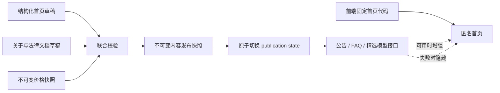

# 固定首页与结构化公共内容设计

**状态：** PENDING_USER_SPEC_REVIEW

**日期：** 2026-09-15

**跨仓库契约草案：** `public-content-structured-home.v2-draft`

**后端基线：** Porsche `origin/main@6ce8e48657cd8bc6a86b286503fde3d0d670749f`

**前端基线：** Porsche-Web `origin/main@f2b8c3e150b5629e25aa1f0b0fb8f02dd17d3771`

**产品来源：** `/Users/xuzhihao/code/PRD-260903-管理员用户管理与公共页面体系.md`

**视觉来源：** `/Users/xuzhihao/Doubao/chats/2026-09-01/new-chat-1/landing-prototype.html` 与同目录原型

## 1. 背景与问题

当前公共首页把 Hero、产品优势、导航、CTA、公告、FAQ 和精选模型都编码在 `home` Markdown 中。前端必须先取得 `/api/v1/public/site` 和 `/api/v1/public/home`，解码成功后才渲染首页。生产尚无完整内容与价格联合发布时，这两个接口返回 `503 committed publication unavailable`，导致固定产品页面也显示“暂时无法显示内容”。

这与已确认的产品边界不符：主页结构、视觉、核心模块和交互应由前端代码稳定提供；管理员只维护会变化的公告、FAQ 和精选模型。关于、服务协议和隐私政策仍属于可审阅、可发布、可恢复的文档。模型价格继续由 Root 独立管理。

## 2. 目标

1. 首页固定主体不依赖公共内容发布状态，在公共内容接口 `404`、`503`、超时或返回非法数据时仍可使用。
2. 将首页可运营内容限制为公告、FAQ、精选模型三种结构化数据。
3. 保留现有不可变发布快照、乐观并发、价格快照绑定、预览、审计和恢复能力。
4. 保持已有公共文档和模型价格接口兼容，允许前后端滚动发布。
5. 匿名接口只读取已发布快照，不回退到草稿、原型或测试数据。

## 3. 范围

### 3.1 本期包含

- 固定的首页导航、Hero、产品优势、能力说明、CTA、页脚、主题和动效。
- 结构化公告、FAQ 与精选模型的 Root 管理界面和接口。
- 公告和 FAQ 的新增、编辑、排序、显示/隐藏和软删除。
- 精选模型的搜索、选择、排序与发布前有效性检查。
- 关于、服务协议、隐私政策的受限 Markdown 草稿、预览、发布、历史版本与恢复。
- 与现有价格快照的原子绑定和静态渲染流程。
- 向后兼容、迁移、异常处理、安全与验收门禁。

### 3.2 本期不包含

- 通用区块编辑器、拖拽式页面搭建、任意 HTML 或任意组件注入。
- 管理员修改首页布局、颜色、字体、Hero 文案、核心产品优势或 CTA 行为。
- 普通管理员内容权限委派；本期沿用当前 Root-only 实现。
- 邮件通知；继续保留为后续待办，当前使用 Root 站内通知。
- 单次调用价；价格仅保留每百万输入 Token 和输出 Token 的 USD 参考价。
- 已删除记录的筛选或恢复入口。

## 4. 已确认产品边界

- 首页布局、视觉、模块、动画与交互由前端代码固定，复用已确认原型的视觉结构。
- 首页固定主体不以 `/api/v1/public/site` 成功作为渲染前提。
- 管理员只维护公告、FAQ 和精选模型。
- 关于、服务协议、隐私政策继续使用受限 Markdown。
- 模型配置与价格快照仍仅允许 Root 管理。
- 动态内容未发布或不可用时隐藏对应模块，不显示测试数据、空白卡片或错误占位。
- 发布和恢复生成不可变新版本；历史快照不被覆盖。
- 模型失效与软删除是两个独立状态；已删除模型不提供筛选查看。
- P08 后续补充真实品牌和营销文案标准。本期固定文案只能描述已经由代码、契约或现行能力验证的事实，禁止写入 `40+`、`100%`、`MIT` 等未审批声明。

## 5. 总体架构



首页使用“固定主体 + 可选动态增强”模型：

- 固定主体来自前端构建产物和 i18n 资源，不读取内容草稿或发布快照。
- 动态增强只读取当前已发布内容快照，并与价格快照保持同代绑定。
- 关于和法律页面继续依赖内容发布；没有已发布版本时显示明确的准备中或不可用状态。
- 公共模型与价格接口继续 fail closed；没有有效价格快照时不公开模型报价。

## 6. 数据模型

### 6.1 聚合版本

现有 `public_content_drafts` 继续作为单例聚合草稿，`revision` 是关于、法律文档和结构化首页共同使用的乐观并发版本。任何草稿写操作必须：

1. 锁定单例草稿；
2. 校验 `expected_revision`；
3. 在同一事务中完成目标写入、审计和 `revision + 1`；
4. 返回新的聚合草稿版本。

这样可以防止一名 Root 编辑 FAQ 时静默覆盖另一名 Root 刚更新的服务协议。

### 6.2 结构化首页草稿项

新增公告和 FAQ 草稿表；两者遵守数据库规范中的内部 `id`、业务雪花 `guid`、UTC Unix 毫秒审计字段、整数枚举和 `is_deleted` 规则。

公告字段：

| 字段 | 含义 |
| --- | --- |
| `guid` | 服务端生成的稳定业务标识，API 始终返回字符串 |
| `title` | 纯文本标题 |
| `body_markdown` | 受限 Markdown 正文 |
| `effective_at` | 可空 UTC Unix 毫秒；为空表示发布后立即生效 |
| `is_visible` | 草稿中的显示开关 |
| `sort_order` | 非负整数，决定稳定顺序 |
| `revision` | 单项版本，用于审计；外部写冲突以聚合 `revision` 为准 |
| `is_deleted` | 软删除标记 |

公告最多 20 条活动草稿；标题为 1–120 个 Unicode 字符，正文最多 16 KiB，`sort_order` 为 `0..1000000`。`effective_at` 精确到秒，API 只接受规范 RFC3339 UTC；服务端转换为 Unix 毫秒持久化。

FAQ 字段：

| 字段 | 含义 |
| --- | --- |
| `guid` | 服务端生成的稳定业务标识，API 始终返回字符串 |
| `question` | 纯文本问题 |
| `answer_markdown` | 受限 Markdown 答案 |
| `is_visible` | 草稿中的显示开关 |
| `sort_order` | 非负整数，决定稳定顺序 |
| `revision` | 单项版本 |
| `is_deleted` | 软删除标记 |

FAQ 最多 50 条活动草稿；问题为 1–200 个 Unicode 字符，答案最多 16 KiB，`sort_order` 为 `0..1000000`。精选模型最多 12 个，不允许重复 `modelKey`。整个内容草稿继续受现有 256 KiB 聚合限制保护。

精选模型保存在草稿 JSON 的有序 `featured_model_keys` 中。每项只保存稳定 `modelKey`，不复制名称、提供商或价格。发布与读取时的模型详情来自同一绑定价格快照。

软删除后的公告和 FAQ 不出现在管理列表、详情、预览或公开接口中，也没有“已删除”筛选。历史内容快照仍保持不可变；恢复旧发布版本时必须继续排除当前已软删除的业务标识，不能借恢复操作复活已删除条目。

### 6.3 不可变发布载荷

`public_content_releases.payload` 增加版本化字段：

```json
{
  "schema_version": 2,
  "home_config": {
    "announcements": [
      {
        "guid": "353589505447432192",
        "title": "维护公告",
        "body_html": "<p>已净化正文</p>",
        "effective_at": "2026-09-15T00:00:00Z",
        "sort_order": 10
      }
    ],
    "faqs": [
      {
        "guid": "353589501827747840",
        "question": "如何开始使用？",
        "answer_html": "<p>登录控制台后创建 API 密钥。</p>",
        "sort_order": 10
      }
    ],
    "featured_model_keys": ["deepseek-chat"]
  },
  "about": "<p>已净化内容</p>",
  "terms": "<p>已净化内容</p>",
  "privacy": "<p>已净化内容</p>",
  "legal_reviewed": true,
  "price_snapshot_guid": "353589000000000001",
  "price_snapshot_version": 3
}
```

发布载荷不保存草稿 Markdown、删除项、上游原始响应或凭据。`content_hash` 对规范化后的完整载荷计算 SHA-256；数组顺序、对象键顺序、空值表示和时间格式必须由服务端唯一确定。

## 7. 接口设计与兼容策略

现有 `public-content-pricing-v1` 路由保持可调用。新增路由采用同一认证、`Cache-Control`、`X-Request-ID`、严格 JSON、GUID 字符串、错误信封和分页规范。实施时更新双方 `interface-contract.json` 及后端权威合同文件；设计阶段不提前声称双方合同已冻结。

### 7.1 Root 结构化首页草稿

| 方法 | 路径 | 用途 | 成功状态 |
| --- | --- | --- | --- |
| `GET` | `/admin/v2/public-content/home-draft` | 读取活动公告、FAQ、精选模型和聚合版本 | `200` |
| `POST` | `/admin/v2/public-content/home-draft/announcements` | 新增公告 | `201` |
| `PATCH` | `/admin/v2/public-content/home-draft/announcements/{guid}` | 更新、排序或显示/隐藏公告 | `200` |
| `DELETE` | `/admin/v2/public-content/home-draft/announcements/{guid}` | 软删除公告 | `204` |
| `POST` | `/admin/v2/public-content/home-draft/faqs` | 新增 FAQ | `201` |
| `PATCH` | `/admin/v2/public-content/home-draft/faqs/{guid}` | 更新、排序或显示/隐藏 FAQ | `200` |
| `DELETE` | `/admin/v2/public-content/home-draft/faqs/{guid}` | 软删除 FAQ | `204` |
| `PUT` | `/admin/v2/public-content/home-draft/featured-models` | 原子替换精选 `modelKey` 有序列表 | `200` |
| `GET` | `/admin/v2/public-content/home-preview?revision={n}` | 返回固定首页预览所需的结构化草稿投影 | `200` |
| `GET` | `/admin/v2/public-content/releases/{guid}/home-config` | 查看历史发布版本的结构化首页配置 | `200` |
| `GET` | `/admin/v2/public-content/documents-draft` | 读取关于与法律文档草稿 | `200` |
| `PUT` | `/admin/v2/public-content/documents-draft` | 保存关于与法律文档，不接收 legacy `home` | `200` |

所有写请求包含 `expected_revision`。新增、更新和精选模型写入返回完整 `HomeDraftResponse`，便于前端立即替换本地状态；删除成功通过响应头返回新的 `X-Content-Draft-Revision`。删除属于敏感内容变更，但不要求当前密码二次验证；发布和恢复继续沿用 action ticket、当前密码和幂等键。

`HomeDraftResponse`：

```json
{
  "revision": 4,
  "announcements": [],
  "faqs": [],
  "featured_model_keys": ["deepseek-chat"]
}
```

草稿时间在 API 中使用 RFC3339 UTC 字符串；持久化使用 UTC Unix 毫秒。请求和响应只接受声明字段，未知字段返回 `400 invalid_request`。

### 7.2 文档接口与 legacy 兼容

- `GET/PUT /admin/v2/public-content/draft` 保留现有响应形状，继续管理 `home`、`about`、`terms`、`privacy` 和 `legal_reviewed`。
- 新前端改用 `/admin/v2/public-content/documents-draft` 管理 `about`、`terms`、`privacy` 和 `legal_reviewed`，不展示也不提交 legacy `home` Markdown。
- 后端在兼容期保留 legacy `home` 字段，但它不参与固定首页渲染，也不作为结构化首页的数据源。
- 旧版 `PUT /draft` 更新文档时必须保留结构化首页草稿，不能重建并覆盖整个未知载荷。
- `POST /validate`、`POST /publish`、发布历史和恢复路由保持原路径，将结构化首页一起纳入校验与快照。
- 兼容期结束和删除 legacy `home` 字段需单独设计、合同升级和双方批准，本期不执行。

### 7.3 匿名读取

新增：

`GET /api/v1/public/home-config`

成功响应：

```json
{
  "announcements": [],
  "faqs": [],
  "featured_model_keys": ["deepseek-chat"],
  "content_release_version": 2,
  "price_release_version": 3
}
```

规则：

- 只返回当前已发布、未删除、`is_visible=true` 的内容。
- `effective_at` 晚于当前 UTC 时间的公告暂不返回；到期后最迟在公共缓存 TTL 内可见，并触发/补偿一次静态渲染任务。
- FAQ 按 `sort_order, guid` 排序；公告按 `sort_order, effective_at, guid` 排序；精选模型保留发布顺序。
- 每个精选 `modelKey` 必须来自绑定的有效价格快照。前端继续通过现有 `/api/v1/public/models/{modelKey}` 获取名称和公开价格。
- 使用现有公共缓存头、ETag 和发布版本头。ETag 必须覆盖实际返回的生效公告集合以及内容和价格版本。
- 未形成完整联合发布时返回现有 `503 unavailable`。固定首页捕获该状态并隐藏动态模块。
- 现有 `/api/v1/public/home` 保留 legacy Markdown 响应，供旧客户端兼容；新首页不调用它。

## 8. 发布、预览与恢复

### 8.1 校验

发布前按同一数据库视图校验：

- 标题、问题为非空纯文本，满足长度限制且不含控制字符。
- Markdown 满足大小限制，净化后仍有可见内容。
- 链接只允许明确批准的 `https`、站内相对路径和受限 `mailto`；拒绝脚本、事件属性、危险协议和畸形 URL。
- 活动项 `sort_order` 合法且顺序确定。
- 精选 `modelKey` 不重复，全部存在于指定价格快照中，模型状态为 active，未软删除，输入/输出 Token 价格完整。
- 关于、服务协议、隐私政策通过既有富文本净化；法律审核状态满足发布规则。
- `expected_revision`、指定价格发布 GUID 和当前 publication state 仍然有效。

校验、快照创建、审计记录、渲染任务入队和 publication state 切换必须遵守现有原子发布语义。任一步失败不产生半发布状态，公开读取继续使用上一个有效版本。

### 8.2 预览

- Root 预览由固定前端页面加载当前结构化草稿、关于/法律草稿和指定价格快照。
- 预览响应使用 `private, no-store` 与 `X-Robots-Tag: noindex, nofollow`。
- 页面持续显示“预览”标识，不允许把预览 URL 当作公开 URL 分享。
- 预览不读取生产公开接口，不改变 publication state，不写读取确认。

### 8.3 恢复

- 恢复历史版本时创建新内容发布版本，不修改历史行。
- 恢复使用当前聚合 `expected_revision`、action ticket、当前密码和幂等键。
- 恢复目标中的精选模型必须重新对当前指定/绑定价格快照校验。
- 当前已软删除的公告、FAQ 和模型不得由历史恢复复活；若过滤后不满足发布条件，恢复返回 `422 validation_failed`。

## 9. 前端设计

### 9.1 公共首页

`PublicLayout`、页头和页脚使用代码内固定路由；不再从发布 Markdown 提取 shell links。`Home` 先同步渲染固定主体，再异步请求 `home-config`：

- Hero 标题、介绍、按钮、优势卡片、能力证明、CTA 和视觉组件来自 Vue/i18n 代码。
- 公告、FAQ、精选模型均为可选区块；有效数据存在时才挂载。
- `404`、`503`、网络失败、超时、版本不一致或响应校验失败只使动态区块保持隐藏，并通过非打断式 `aria-live` 状态向辅助技术说明。
- 禁止用 mock、prototype、legacy `home` Markdown 或草稿补齐缺失数据。
- 关于、服务协议、隐私政策继续只显示已发布文档，并保留明确错误/准备状态。
- 浅色、深色、桌面、移动端和 `prefers-reduced-motion` 沿用已确认原型和现有过渡规范。

### 9.2 Root 管理页

`PublicContentAdmin` 的“首页”Markdown 编辑器替换为：

- 公告列表与表单：标题、正文、生效时间、显示状态、排序、软删除。
- FAQ 列表与表单：问题、答案、显示状态、排序、软删除。
- 精选模型搜索与有序选择器：只显示当前可配置模型，保存稳定 `modelKey`。

关于、服务协议、隐私政策继续使用 `SafeMarkdownEditor`。页面保存任何一块后都用服务端返回的完整状态替换本地副本并清除旧验证证明。收到 `409` 时保留未提交表单副本，刷新服务端版本并向 Root 展示需要人工重新核对的差异，禁止自动覆盖。

## 10. 失败处理

| 场景 | 公共页面行为 | Root 管理行为 |
| --- | --- | --- |
| 尚无内容发布 | 固定首页正常；动态区块隐藏 | 显示空草稿和发布前置条件 |
| `home-config` 404/503/超时 | 固定首页正常；动态区块隐藏 | 可重试并显示脱敏 request ID |
| 响应合同或版本不一致 | 丢弃动态响应 | 标记合同错误，不接受部分数据 |
| 精选模型失效或缺价 | 不显示问题模型；若联合代际无效则 fail closed | 发布校验失败并定位 `modelKey` |
| 发布或渲染失败 | 保留上一有效发布 | 记录 Root 站内通知和审计 |
| 草稿 revision 冲突 | 不影响当前公开版本 | 返回 `409`，刷新并人工核对 |
| 恢复结果不确定 | 保留当前公开版本 | 使用既有幂等尝试进行 reconciliation |

公开错误和管理错误不得包含上游原始正文、渠道地址、凭据、草稿内容、数据库内部 ID 或堆栈。

## 11. 安全、权限与审计

- 本期所有 `/admin/v2/public-content/**` 写接口和读取草稿接口继续要求 Root。
- 匿名接口只返回发布载荷，绝不查询草稿表作为回退。
- Markdown 服务端净化是权威边界；前端预览净化不能代替后端验证。
- 发布与恢复继续使用 action verification、当前密码、幂等键和重放保护。
- 新增、更新、显示/隐藏、排序、软删除、发布和恢复均记录 actor、目标 GUID、聚合 revision、时间和结果；审计载荷不记录正文全文或密码。
- 精选模型只保存稳定 `modelKey`，禁止前端自行构造价格或上游身份。
- 不新增凭据到浏览器持久化、日志、合同、快照或通知。

## 12. 迁移与发布顺序

1. 后端新增表、结构化服务和兼容接口，迁移只增加结构，不自动发布内容。
2. 后端在 legacy 文档保存路径中保留结构化草稿；新增公开接口在无 v2 发布时返回 `503`。
3. 前端上线固定首页和可选动态加载。此时即使后端未发布内容，固定首页也应正常。
4. Root 在后台录入并预览真实公告、FAQ 和精选模型，完成 P08 适用内容核对。
5. Root 显式发布首个结构化内容快照并验证匿名接口、静态产物和浏览器页面。
6. 稳定观察后再单独决定 legacy `home` Markdown 和 `/api/v1/public/home` 的退役计划。

迁移不得合成公告、FAQ、精选模型或营销文案，不得把旧 `home` Markdown 自动拆分为结构化记录。旧字段只作为兼容数据保留。

P08 不阻塞代码部署或使用审慎、可验证文案的固定首页；它阻止未经确认的营销数字、授权声明和法律文案进入生产发布。

## 13. 测试与验收

### 13.1 后端

- 真实 MySQL 迁移 up/status、表结构和回滚边界。
- 聚合 revision 的并发新增、更新、排序、隐藏和软删除。
- legacy `/draft` 保存不覆盖结构化首页数据。
- 严格 JSON、GUID 字符串、时间、长度、排序、重复 `modelKey` 和未知字段。
- Markdown/HTML/URL 对抗样本净化。
- 精选模型存在、active、未删除、价格完整和绑定快照一致。
- 发布、恢复、幂等重放、commit unknown、渲染失败和上一版本保留。
- 匿名接口只读发布快照，未来生效公告与 ETag/TTL 一致。
- Root/普通管理员/匿名权限矩阵及脱敏错误。

### 13.2 前端

- `/api/v1/public/site` 和 `home-config` 返回 `503` 时固定首页仍完整显示。
- 未发布、隐藏、未来生效、已删除的公告和 FAQ 不显示。
- 精选模型只显示与发布版本一致的真实模型；部分失败不注入占位数据。
- 管理页不再提供首页 Markdown 编辑器。
- 新增、编辑、排序、隐藏、软删除、搜索精选模型和表单状态恢复。
- `409` 保留本地输入并阻止自动覆盖；旧 validation proof 在任意修改后失效。
- 预览 no-store/noindex、发布无部分成功、恢复生成新版本。
- 375/390/768/1280/1600 视口、浅色/深色、键盘、焦点、Esc、屏幕阅读器状态和 reduced motion。
- 权威合同测试、全量测试、生产构建、公共模块图、敏感值扫描和 `git diff --check`。

### 13.3 联合验收

- 冻结后端 revision、前端 revision、契约版本和文件哈希。
- 验证公共首页无发布、有效发布、旧版兼容、接口失败和版本切换五种状态。
- 使用真实 Root 账号完成草稿、预览、发布、历史和恢复；使用非 Root 账号验证拒绝。
- 验证发布内容、价格快照、静态渲染产物和浏览器展示属于同一代际。
- 本地或 synthetic 通过标为 `PASS_LIMITED_SCOPE`；生产迁移、部署和真实内容发布必须独立记录，不因代码合并自动视为完成。

## 14. 实施门禁

本设计文档经用户确认后才能生成逐任务实施计划。实施采用前后端隔离工作树，任何接口变化都要同步更新双方合同并由协调角色书面确认。每个代码快照按仓库风险规范依次完成规格、安全、测试/质量复审；任何受审文件变化都会使旧快照失效。

实施、推送、PR、合并、数据库迁移、部署和生产内容发布是后续独立动作；本设计批准本身不代表这些动作已经获批或完成。
